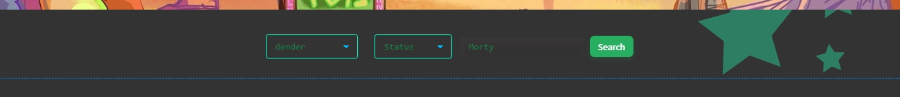
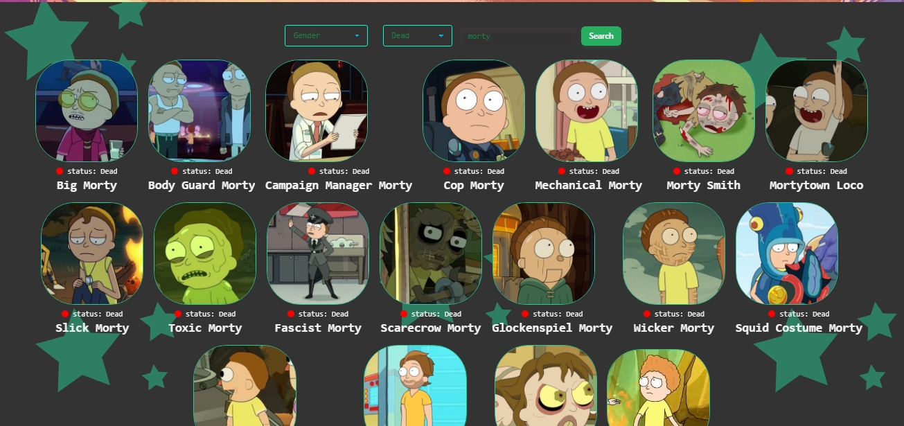
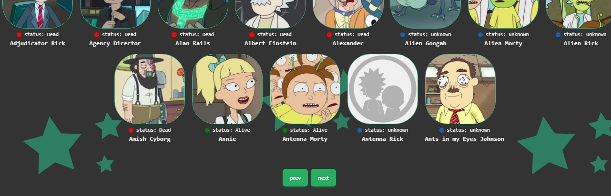

### 
### This is an HTML and JavaScript code for a webpage that displays characters from the animated TV series "Rick and Morty". The code includes a search form with dropdown menus for gender and status, and a search input field. It also includes a card container where the characters are displayed along with their name, image, and status.
;
#### How looks like when you filter and search:

### There are two buttons for navigation, one for moving to the next page of characters and one for moving to the previous page. The code uses the Rick and Morty API to fetch the character data and display it on the page.

### The JavaScript code includes an event listener for the next and previous buttons, which updates the page variable and calls the getPagination function to fetch the next or previous page of characters. The card function creates the HTML for each character card and appends it to the card container.The code also includes some CSS styles for the background image and the character cards.